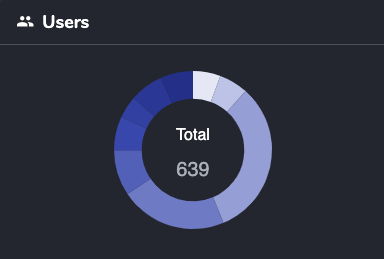
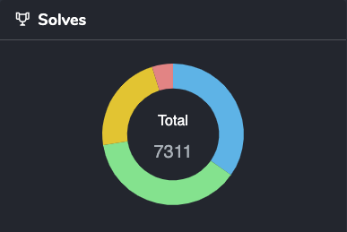

# HackyEaster 2024

## Thank You
First, a big thank you to the volunteers (inik, ice, khae, daubsi, darkstar, dr_nick, roggy85, otaku), and all supporters that bought one or more [Ko-Fi](https://ko-fi.com/hackyeaster)!

## Challenges
You can find all challenges, including sources, dockerfiles, solution, etc. in the challenges/ folder.

## Write-Ups
The following write-ups have been written (contact me at hackyeaster@gmail.com if you want yours to be added). In alphabetical order:

- [Maxou](https://github.com/paul-maxime/ctf-writeups/tree/main/hackyeaster2024)
- [Brav-ura](https://github.com/Brav-ura/Hacky-easter-2024)
- [ngroegli](https://github.com/ngroegli/hacky-easter-2024)
- [bcluyse](https://github.com/bcluyse/he2024-writeup)

## Ph1n1sh3rs
The following players have beaten all levels and got rewarded with a "Ph1n1sh3r" badge. Congrats!

darkice, darkstar, ice, EngyCZ, keep3r, daubsi, brp64, triggermehappy, amra13579, w3th4nds, TRX, AstroViking, Kaythen, Akonia, marwin79, spire, explo1t, 0rb1t4l, GNZL, tachyon, c_zer0, H4ck0pp, cloverKP, cw-dude, Smartsmurf, dr_nick, xebuc, delo, crazyanu, OBI, Nemah, сtftteam, z0rg, S0Kala, atom0wl, Ho3rnch3n, bcluyse, l1r, Mitsch, easterwombat, azi, chaetschi, mcia

## Perfect solvers
The following Ph1n1shers also managed to solve **all** challenges.

darkice, darkstar, ice, EngyCZ, keep3r, daubsi, brp64, triggermehappy, amra13579, w3th4nds, TRX, AstroViking, Kaythen, Akonia, marwin79, spire, explo1t, 0rb1t4l, GNZL, tachyon, c_zer0, H4ck0pp, cloverKP, cw-dude, Smartsmurf

## Survey Results
[Hacky Easter 2024 Survey Results.pdf](docs/Hacky%20Easter%202024%20Survey%20Results.pdf "Survey Results PDF")

## Top 20

## Stats
### Players
| players | count |
| :- | -: |
| ph1n1sh3r (level 9) | 43 |
| level 8 | 44 |
| level 7 | 29 |
| level 6 | 44 |
| level 5 | 60 |
| level 4 | 140 |
| level 3 | 205 |
| level 2 | 38 |
| level 1 | 36 |
| **total** | 639 |

### Solves
| solves | count |
| :- | -: |
| noob | 2540 |
| easy | 2764 |
| medium | 1656 |
| hard | 351 |
| **total** | 7311 |

